# Pyparsing Class Structure

This document outlines the class hierarchy and structure for the `pyparsing` library, focusing on the core parser classes and supporting modules.

## Class Hierarchy Diagram

The following Mermaid diagram illustrates the relationships between the major classes in `pyparsing`.

```mermaid
classDiagram
    class ParseBaseException {
        +line
        +lineno
        +column
        +explain()
        +mark_input_line()
    }
    class ParseException
    class ParseFatalException
    class ParseSyntaxException
    
    ParseBaseException <|-- ParseException
    ParseBaseException <|-- ParseFatalException
    ParseFatalException <|-- ParseSyntaxException

    class ParserElement {
        <<abstract>>
        +name: str
        +results_name: str
        +parse_string()
        +scan_string()
        +search_string()
        +transform_string()
        +set_results_name()
        +add_parse_action()
        +add_condition()
        +suppress()
        +ignore()
    }

    class Token {
        <<abstract>>
    }
    class ParseExpression {
        <<abstract>>
        +exprs: list
    }
    class ParseElementEnhance {
        <<abstract>>
        +expr: ParserElement
    }

    ParserElement <|-- Token
    ParserElement <|-- ParseExpression
    ParserElement <|-- ParseElementEnhance

    %% Tokens
    class Literal
    class Keyword
    class Word
    class Regex
    class QuotedString
    class White
    class Empty
    class CharsNotIn
    
    Token <|-- Literal
    Token <|-- Keyword
    Token <|-- Word
    Token <|-- Regex
    Token <|-- QuotedString
    Token <|-- White
    Token <|-- Empty
    Token <|-- CharsNotIn
    
    Literal <|-- CaselessLiteral
    Keyword <|-- CaselessKeyword
    Word <|-- Char

    %% Position Tokens
    class PositionToken
    class LineStart
    class LineEnd
    class StringStart
    class StringEnd
    class WordStart
    class WordEnd

    Token <|-- PositionToken
    PositionToken <|-- LineStart
    PositionToken <|-- LineEnd
    PositionToken <|-- StringStart
    PositionToken <|-- StringEnd
    PositionToken <|-- WordStart
    PositionToken <|-- WordEnd

    %% Expressions (Combinants)
    class And
    class Or
    class MatchFirst
    class Each

    ParseExpression <|-- And
    ParseExpression <|-- Or
    ParseExpression <|-- MatchFirst
    ParseExpression <|-- Each

    %% Enhancers
    class OneOrMore
    class ZeroOrMore
    class Opt
    class SkipTo
    class Forward
    class Group
    class Dict
    class Suppress
    class Combine
    class Located
    class NotAny
    class FollowedBy
    class PrecededBy

    ParseElementEnhance <|-- OneOrMore
    ParseElementEnhance <|-- ZeroOrMore
    ParseElementEnhance <|-- Opt
    ParseElementEnhance <|-- SkipTo
    ParseElementEnhance <|-- Forward
    ParseElementEnhance <|-- Located
    ParseElementEnhance <|-- NotAny
    ParseElementEnhance <|-- FollowedBy
    ParseElementEnhance <|-- PrecededBy
    ParseElementEnhance <|-- TokenConverter

    class TokenConverter
    TokenConverter <|-- Group
    TokenConverter <|-- Dict
    TokenConverter <|-- Suppress
    TokenConverter <|-- Combine

    %% Results
    class ParseResults {
        +as_list()
        +as_dict()
        +dump()
        +get()
        +items()
        +keys()
    }
    
    %% Helper Classes
    class pyparsing_common {
        <<static>>
        +integer
        +real
        +identifier
        +ipv4_address
    }
    
    class unicode_set {
        <<abstract>>
        +printables
        +alphas
        +nums
    }
    
    class pyparsing_unicode {
        +Latin1
        +Greek
        +Cyrillic
        +CJK
    }
    
    unicode_set <|-- pyparsing_unicode
    
    class OpAssoc {
        <<enumeration>>
        LEFT
        RIGHT
    }
```

## Module Overview

The pyparsing library is organized into several key modules:

### `core.py`
The heart of the library, containing the base `ParserElement` class and its primary subclasses:
- **`ParserElement`**: The abstract base class for all pyparsing expressions.
- **`Token`**: Base class for expressions that match fixed strings or patterns (e.g., `Literal`, `Word`, `Regex`).
- **`ParseExpression`**: Base class for expressions that combine other expressions (e.g., `And`, `Or`, `MatchFirst`).
- **`ParseElementEnhance`**: Base class for expressions that wrap and modify a single expression (e.g., `Optional`, `ZeroOrMore`, `Group`).

### `results.py`
Defines the `ParseResults` class, which is returned by the `parse_string` method. It provides a dictionary-like and list-like interface to the parsed tokens.

### `exceptions.py`
Contains the exception hierarchy used by pyparsing:
- **`ParseBaseException`**: Base class for all parsing exceptions.
- **`ParseException`**: Raised when a parsing error occurs.
- **`ParseFatalException`**: Raised when a parsing error occurs that should stop further searching for alternatives.

### `common.py`
Provides `pyparsing_common`, a namespace containing commonly used parser expressions like `integer`, `real`, `identifier`, and various date/time parsers.

### `unicode.py`
Contains `pyparsing_unicode`, which provides `unicode_set` definitions for various languages and character sets (Latin, Greek, Cyrillic, CJK, etc.).

### `helpers.py`
Offers high-level helper functions and classes for constructing complex parsers, such as `infix_notation`, `nested_expr`, `delimited_list`, and `original_text_for`.

### `actions.py`
Provides useful parse actions and decorators, such as `replace_with`, `remove_quotes`, and `with_attribute`.
